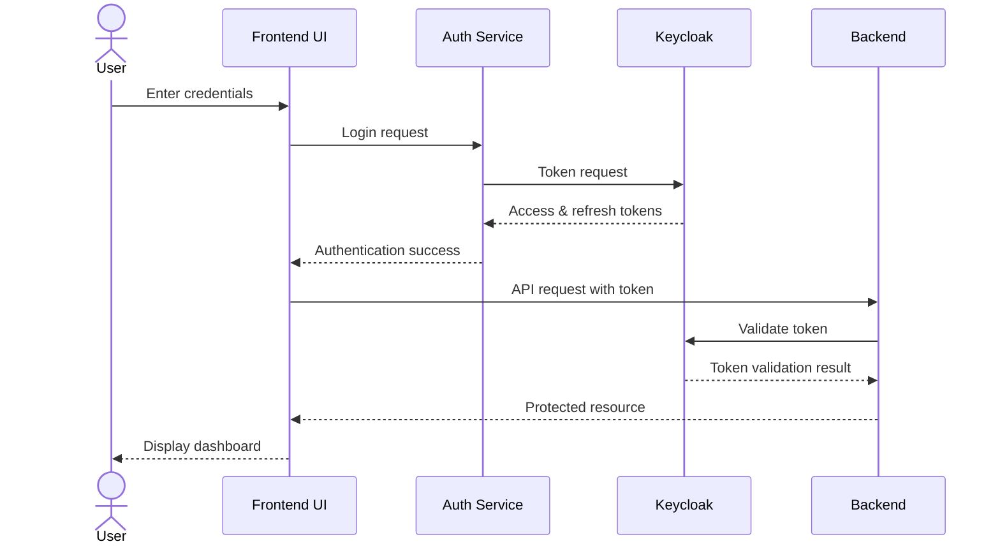
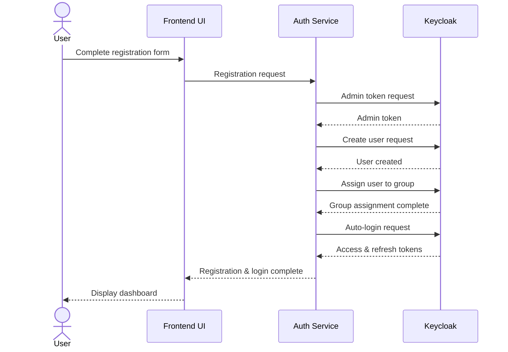

# PharmacyHub Authentication & Authorization

## Overview

PharmacyHub implements a robust, secure authentication and authorization system using Keycloak 25.0.2. This system provides custom UI integration while leveraging Keycloak's security features, including role-based access control, social login, and multi-factor authentication.

## Table of Contents

1. [Authentication Architecture](#authentication-architecture)
2. [Keycloak Integration](#keycloak-integration)
3. [Permission System](#permission-system)
4. [Authentication Flows](#authentication-flows)
5. [Integration Components](#integration-components)
6. [Security Considerations](#security-considerations)
7. [Customization Guide](#customization-guide)
8. [Troubleshooting](#troubleshooting)

## Authentication Architecture

The authentication system follows a modern, secure architecture:

```
┌────────────────────┐    ┌────────────────────┐    ┌────────────────────┐
│                    │    │                    │    │                    │
│  React Components  │    │  AuthContext       │    │  Permission Guards │
│                    │    │                    │    │                    │
└────────┬───────────┘    └─────────┬──────────┘    └────────┬───────────┘
         │                          │                        │
         └──────────────────────────┼────────────────────────┘
                                   │
                                   ▼
┌──────────────────────────────────────────────────────────────────────────┐
│                                                                          │
│                           Keycloak Service                               │
│                                                                          │
└────────────────────────────────────┬─────────────────────────────────────┘
                                    │
                                    ▼
┌──────────────────────────────────────────────────────────────────────────┐
│                                                                          │
│                           Keycloak Server                                │
│                                                                          │
└────────────────────────────────────┬─────────────────────────────────────┘
                                    │
                                    ▼
┌──────────────────────────────────────────────────────────────────────────┐
│                                                                          │
│                           Backend API                                    │
│                                                                          │
└──────────────────────────────────────────────────────────────────────────┘
```

### Key Components

1. **Frontend Components**:
   - Custom login/registration forms
   - Profile management
   - Password reset flows

2. **Authentication Context**:
   - Centralized authentication state
   - Permission checking
   - Role verification

3. **Keycloak Service**:
   - Token management
   - User profile handling
   - Permission mapping

4. **Keycloak Server**:
   - User storage
   - Authentication protocols
   - Identity federation

5. **Backend API**:
   - Token validation
   - Resource protection
   - Fine-grained access control

## Keycloak Integration

PharmacyHub integrates with Keycloak 25.0.2 for identity and access management. The integration supports custom UI components while leveraging Keycloak's security features.

### System Components
- **Keycloak Server**: Running on port 8080
- **Frontend Application**: Next.js app on port 3000
- **Backend API**: Spring Boot service on port 8081

### Integration Details

For comprehensive details on the Keycloak integration, including configuration, flows, and implementation, see the [Keycloak Integration Guide](./keycloak-integration.md).

## Permission System

PharmacyHub implements a sophisticated permission system based on a hierarchical model:

```
Groups
  └── Roles
       └── Permissions
```

### Permission Structure

Permissions follow a `domain:action` format:
- `domain` - The resource area (e.g., `pharmacy`, `user`)
- `action` - The operation (e.g., `create`, `view`)

Examples:
- `pharmacy:create` - Permission to create pharmacies
- `users:manage` - Permission to manage users
- `reports:view` - Permission to view reports

### Centralized Permission Management

All permissions are defined in a single source file:

```typescript
// permissions.ts
export const PERMISSIONS = {
  SYSTEM: {
    MANAGE: 'manage:system',
    AUDIT: 'audit:system',
    // ...
  },
  USER: {
    MANAGE: 'manage:users',
    VIEW: 'view:users',
    // ...
  },
  // Additional categories...
};
```

### Role-Based Permissions

Roles map to sets of permissions:

```typescript
export const ROLE_PERMISSIONS = {
  SUPER_ADMIN: [
    PERMISSIONS.SYSTEM.MANAGE,
    PERMISSIONS.SYSTEM.AUDIT,
    // ...
  ],
  ADMIN: [
    PERMISSIONS.USER.MANAGE,
    PERMISSIONS.USER.VIEW,
    // ...
  ],
  // Additional roles...
};
```

For comprehensive details on the permission system architecture, see the [Permission System Documentation](./permission-system.md).

## Authentication Flows

### Login Flow

1. User enters credentials in custom login form
2. Frontend sends credentials to Keycloak token endpoint
3. Keycloak validates credentials and returns tokens
4. Frontend stores tokens and extracts user profile
5. User is redirected to dashboard



### Registration Flow

1. User completes multi-step registration form
2. Frontend obtains admin token from Keycloak
3. Frontend creates user in Keycloak via Admin API
4. User is assigned to appropriate group based on user type
5. Frontend logs in the user automatically



### Social Login Flow

1. User clicks social login button (Google/Microsoft)
2. Frontend redirects to Keycloak with identity provider hint
3. Keycloak handles the OAuth flow with the provider
4. After successful authentication, Keycloak redirects to callback endpoint
5. Callback endpoint exchanges code for tokens
6. User is redirected to dashboard

### Token Refresh

1. Before making API requests, frontend checks token expiration
2. If token is expired or close to expiry, refresh flow is triggered
3. Refresh token is sent to Keycloak token endpoint
4. New access and refresh tokens are stored
5. Original API request proceeds with new token

## Integration Components

### Core Components

1. **AuthContext** (`src/shared/auth/AuthContext.tsx`)
   - Provides authentication state
   - Exposes login/logout methods
   - Handles permission checks

   ```typescript
   // Usage example
   const { user, isAuthenticated, login, logout, hasPermission } = useAuth();
   ```

2. **KeycloakService** (`src/shared/auth/keycloakService.ts`)
   - Handles token management
   - Provides user profile information
   - Manages registration process

   ```typescript
   // Usage example
   import keycloakService from '@/shared/auth/keycloakService';
   const token = await keycloakService.getAccessToken();
   ```

3. **Permission Guards** (`src/shared/auth/PermissionGuard.tsx`)
   - Components for permission-based rendering
   - Role-based component rendering
   - Custom permission hooks

   ```tsx
   // Usage example
   <PermissionGuard permission={PERMISSIONS.PHARMACY.CREATE}>
     <CreatePharmacyButton />
   </PermissionGuard>
   ```

4. **API Client** (`src/shared/api/apiClient.ts`)
   - Attaches authentication tokens to requests
   - Handles token refresh during API calls
   - Provides consistent error handling

   ```typescript
   // Usage example
   import apiClient from '@/shared/api/apiClient';
   const response = await apiClient.get('/pharmacies');
   ```

For detailed implementation guidance, see the [Developer Permission Guide](./developer-permission-guide.md).

## Security Considerations

### Token Security

- Access tokens have short lifespan (15 minutes)
- Refresh tokens have longer lifespan (24 hours)
- Token rotation on refresh
- Secure storage mechanisms
- CSRF protection

### JWT Security

- Signature validation
- Expiration checking
- Audience validation
- Token encryption (optional)
- Claims validation

### Password Policies

Keycloak enforces the following password policies:
- Minimum length: 8 characters
- At least 1 uppercase letter
- At least 1 lowercase letter
- At least 1 digit
- Cannot match username

### Brute Force Protection

- Account lockout after 5 failed attempts
- Progressive delays between attempts
- IP-based rate limiting
- Suspicious activity monitoring

### Session Management

- Secure session handling
- Automatic session termination
- Session fixation prevention
- Concurrent session control

## Customization Guide

### Custom Login Components

The system supports custom login UI while maintaining Keycloak security:

```tsx
// Custom login component
import { useAuth } from '@/shared/auth';

const CustomLoginForm = () => {
  const [username, setUsername] = useState('');
  const [password, setPassword] = useState('');
  const { login } = useAuth();
  
  const handleSubmit = async (e) => {
    e.preventDefault();
    await login(username, password);
  };
  
  return (
    <form onSubmit={handleSubmit}>
      {/* Custom login form fields */}
    </form>
  );
};
```

### Custom Registration Flow

Custom multi-step registration with Keycloak integration:

```tsx
// Example multi-step registration
import { useAuth } from '@/shared/auth';

const RegistrationForm = () => {
  const [step, setStep] = useState(1);
  const [formData, setFormData] = useState({});
  const { register } = useAuth();
  
  const handleSubmit = async () => {
    await register(formData);
  };
  
  return (
    <div>
      {step === 1 && <AccountInfoStep onNext={() => setStep(2)} />}
      {step === 2 && <PersonalInfoStep onNext={() => setStep(3)} />}
      {step === 3 && (
        <ConfirmationStep onSubmit={handleSubmit} />
      )}
    </div>
  );
};
```

### Theming

While using custom UI, you can still customize Keycloak's native screens:

1. **Theme Customization**: Create custom Keycloak themes
2. **Email Templates**: Customize verification emails
3. **Error Pages**: Brand error pages consistently

For detailed customization instructions, see [Keycloak Customization](./keycloak-customization.md).

## Troubleshooting

### Common Issues

1. **Token Refresh Failures**
   - Check refresh token expiration
   - Verify client secret is correct
   - Ensure Keycloak server is reachable

2. **Permission Denied Errors**
   - Verify user has required permission in Keycloak
   - Check permission constant matches Keycloak definition
   - Inspect token content for permission claims

3. **Registration Failures**
   - Verify admin token is being obtained correctly
   - Check group paths match Keycloak configuration
   - Ensure username/email uniqueness constraints

### Debugging Tools

1. **Token Inspection**
   ```javascript
   // Decode JWT payload
   const payload = JSON.parse(atob(token.split('.')[1]));
   console.log('Token payload:', payload);
   ```

2. **Permission Verification**
   ```javascript
   // Check if user has specific permission
   const hasPermission = await keycloakService.hasPermission('create:pharmacy');
   console.log('Can create pharmacy:', hasPermission);
   ```

3. **Network Monitoring**
   - Check network requests to Keycloak endpoints
   - Verify correct headers are being sent
   - Check response status codes and error messages

### Logging

The authentication system includes comprehensive logging:
- Authentication attempts
- Permission checks
- Token refresh events
- Registration flow events

Configure logging levels in the environment variables:
```
AUTH_LOG_LEVEL=debug|info|warn|error
```

## Additional Documentation

- [Keycloak Integration Guide](./keycloak-integration.md)
- [Permission System Architecture](./permission-system.md)
- [Developer Permission Guide](./developer-permission-guide.md)
- [Authentication API Reference](./auth-api-reference.md)
