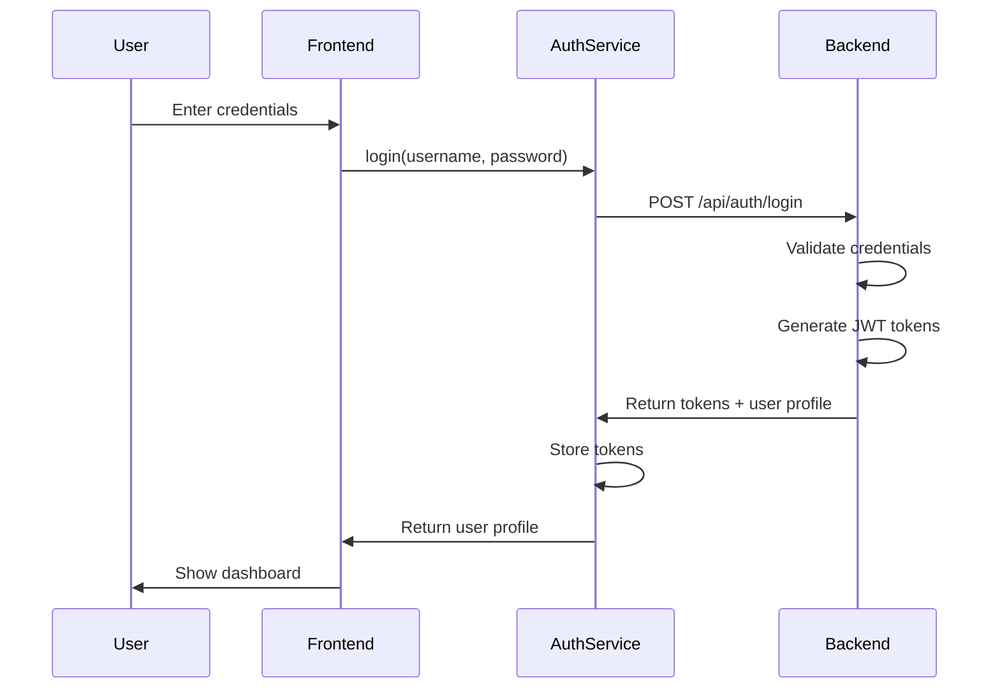
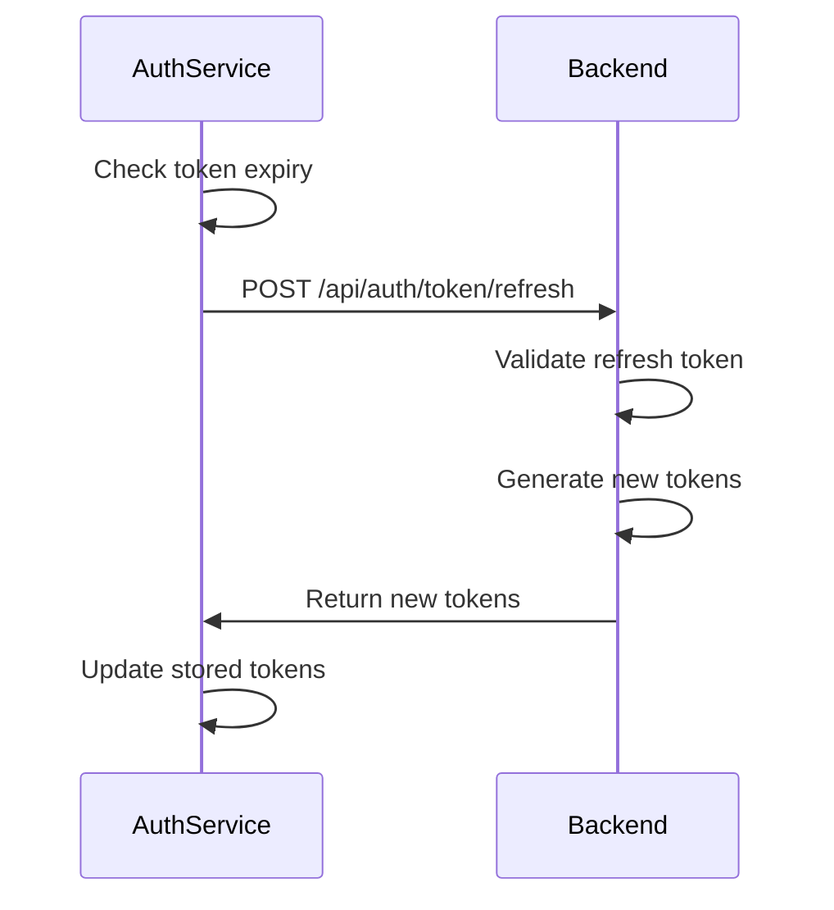
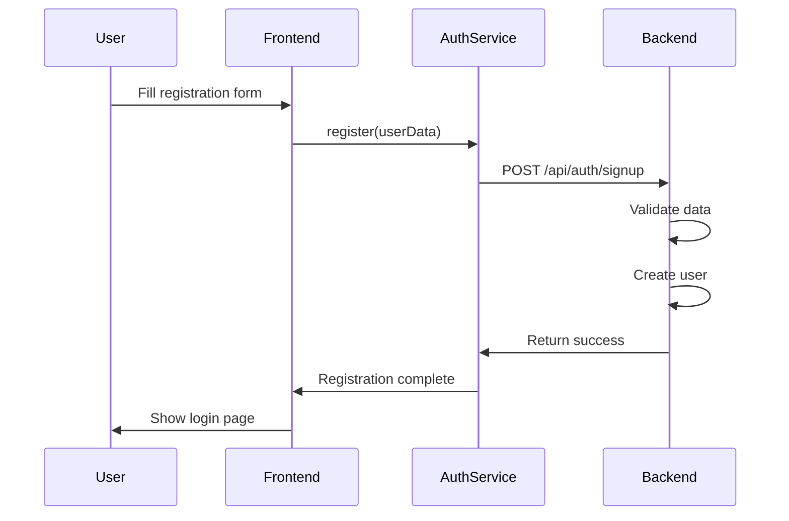

# Authentication Flow Details

## Overview

This document describes the authentication flow in PharmacyHub, which uses JWT-based authentication with a custom backend service.

## Authentication Flows

### 1. Login Flow



### 2. Token Refresh Flow



### 3. Registration Flow



## Token Storage

Tokens are stored securely in the browser's localStorage:

```typescript
TOKEN_CONFIG = {
  ACCESS_TOKEN_KEY: 'pharmacyhub_access_token',
  REFRESH_TOKEN_KEY: 'pharmacyhub_refresh_token',
  TOKEN_EXPIRY_KEY: 'pharmacyhub_token_expiry',
  USER_PROFILE_KEY: 'pharmacyhub_user_profile'
}
```

## Security Measures

1. **Token Expiry**: Access tokens expire after a short period
2. **Automatic Refresh**: Tokens are automatically refreshed before expiry
3. **Secure Storage**: Tokens are stored with appropriate security measures
4. **CORS Protection**: API requests are protected by CORS policies
5. **Rate Limiting**: Login attempts are rate-limited

## Error Handling

The authentication system handles various error scenarios:

```typescript
try {
  await authService.login(username, password);
} catch (error) {
  if (error.status === 401) {
    // Invalid credentials
  } else if (error.status === 429) {
    // Rate limit exceeded
  } else {
    // Other errors
  }
}
```

## Session Management

Sessions are managed through:

1. Token-based authentication
2. Automatic token refresh
3. Session expiry tracking
4. Secure logout process

## API Endpoints

| Endpoint | Method | Description |
|----------|---------|-------------|
| /api/auth/login | POST | User login |
| /api/auth/signup | POST | User registration |
| /api/auth/logout | POST | User logout |
| /api/auth/token/refresh | POST | Refresh access token |
| /api/auth/reset-password | POST | Reset password |

## Configuration

Configure authentication behavior through environment variables:

```env
# Session Configuration
SESSION_MAX_AGE=86400 # 24 hours
REFRESH_TOKEN_ROTATION=true
LOGIN_ATTEMPTS_LIMIT=5
LOGIN_ATTEMPTS_WINDOW=900 # 15 minutes

# API Configuration
API_BASE_URL=http://localhost:8080
API_AUTH_SECRET=your-secret-here
```

## Related Documentation

- [API Documentation](../api/auth.md)
- [Security Best Practices](../security/README.md)
- [Environment Configuration](../configuration/env-vars.md)
