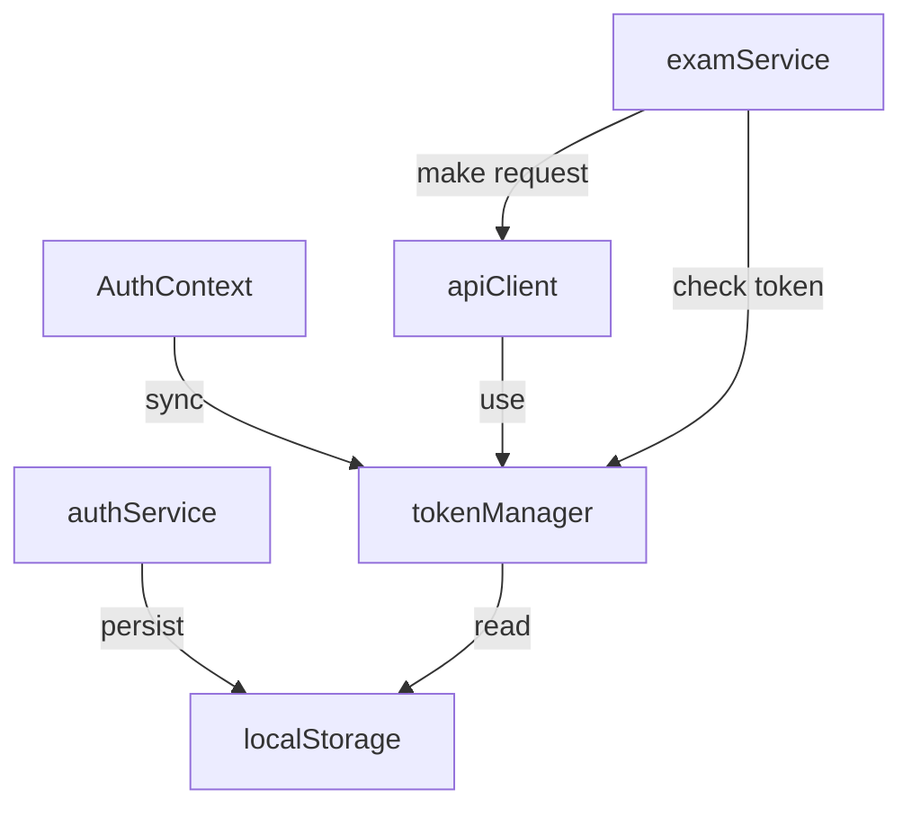

# Exam Feature Authentication Integration Solution

## Problem Overview
The exam feature was experiencing authentication issues due to token synchronization problems between different auth management systems:
- AuthContext for React context-based auth state
- tokenManager for API request authentication
- authService for backend communication
- localStorage for persistence

## Key Issues Found
1. Token synchronization issue between systems
2. Published exams endpoint requiring auth despite being marked as public
3. Inconsistent auth header handling

## Solution Implemented

### 1. Auth State Management
- Updated AuthContext to properly sync with tokenManager
- Added userType to UserProfile type to support role-based access
- Unified token management between authService and tokenManager

### 2. API Integration Improvements
- Added intelligent auth handling in examService:
  ```typescript
  async getPublishedExams(): Promise<Exam[]> {
    // Try to get token if available
    const token = tokenManager.getToken();
    const useAuth = !!token;

    const response = await apiClient.get<BackendExam[]>(`${BASE_PATH}/published`, {
      requiresAuth: useAuth,
      headers: useAuth ? {
        'Authorization': `Bearer ${token}`
      } : undefined
    });
  }
  ```

### 3. Token Flow


### 4. Authentication Strategy
1. Try unauthenticated request first for public endpoints
2. If 403, fallback to authenticated request when token is available
3. Proper error handling and user feedback

### 5. Key Components Modified

#### examService.ts
```typescript
// Smart auth handling
const token = tokenManager.getToken();
const useAuth = !!token;

// Fallback mechanism
if (response.error && response.status === 403 && !useAuth) {
  return this.getAllExams();
}
```

#### AuthContext.tsx
```typescript
// Token synchronization
if (accessToken) {
  tokenManager.setToken(accessToken);
  if (expiry) {
    tokenManager.setTokenExpiry(parseInt(expiry));
  }
}
```

## Testing and Validation
1. Token Refresh Flow
   - Verify token refresh works correctly
   - Check token synchronization between systems

2. Authorization Scenarios
   - Test public endpoints both with and without auth
   - Verify fallback mechanisms work correctly
   - Check error handling and user feedback

3. Key Test Cases
   ```typescript
   // Should work without auth
   await examService.getPublishedExams();
   
   // Should require auth
   await examService.getAllExams();
   
   // Should handle auth failures gracefully
   try {
     await examService.startExam(1);
   } catch (error) {
     // Should show proper error message
   }
   ```

## Monitoring
1. Added debug logs for auth state changes
2. Improved error tracking for auth failures
3. Added token debugging utilities
4. Token status visibility in dev tools

## Future Recommendations
1. Consider caching strategies for better performance
2. Add retry mechanisms for failed auth refreshes
3. Implement progressive loading for exam content
4. Add real-time token validation

## References
- Next-Auth Documentation
- React Query Best Practices
- JWT Token Management Patterns
- Token Refresh Best Practices
