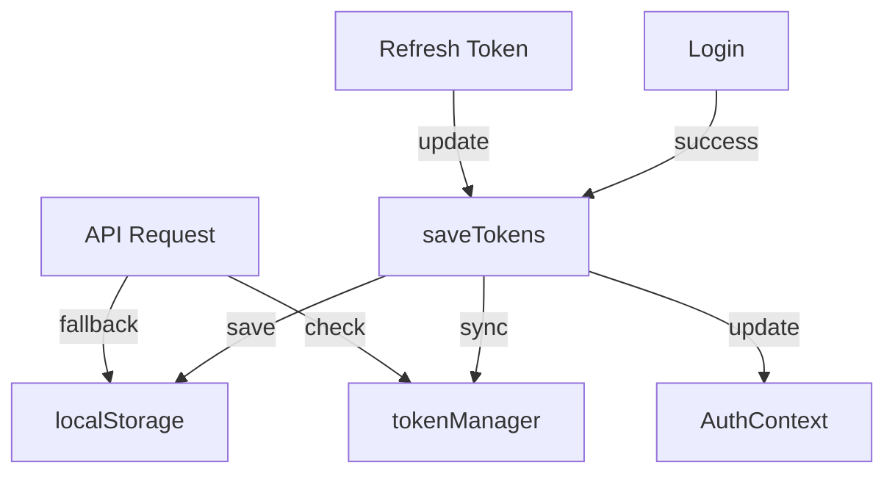

# Token Flow & Authentication

## Overview
The authentication flow has been improved to handle tokens more reliably and provide better error handling.

## Token Storage Locations
1. localStorage (primary storage)
2. tokenManager (in-memory for API requests)
3. authService (for auth state management)

## Flow Diagram


## Authentication States

### 1. Initial Login
```typescript
// In authService
login = async (emailAddress: string, password: string) => {
  const data = await loginRequest();
  this.saveTokens(data);
  await this.getUserProfile();
}
```

### 2. API Requests
```typescript
// In examService
const token = localStorage.getItem(TOKEN_CONFIG.ACCESS_TOKEN_KEY) || 
              tokenManager.getToken();
if (token) {
  headers['Authorization'] = `Bearer ${token}`;
}
```

### 3. Token Refresh
```typescript
// In authService
refreshToken = async () => {
  const data = await refreshRequest();
  this.saveTokens(data);
  tokenManager.setToken(data.access_token);
}
```

## Error Handling

### Authentication Required
```typescript
if (!token) {
  throw new Error('Authentication required');
}
```

### Token Expired
```typescript
if (now > expiry - 5 * 60 * 1000) {
  await this.refreshToken();
}
```

### Public Endpoint Fallback
```typescript
// Try without auth first
const response = await apiClient.get(endpoint, { requiresAuth: false });
if (response.error?.status === 403) {
  // Fallback to authenticated request
  return authenticatedRequest();
}
```

## Testing Points
1. Token persistence across page reloads
2. Proper token refresh before expiry
3. Graceful handling of auth failures
4. Public endpoint access handling
5. Token synchronization between storage locations
