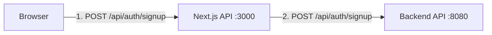

# Authentication Architecture

## API Routes Flow

The application uses a two-tier API architecture:

1. **Next.js API Routes (Port 3000)**
   - These are proxy endpoints that handle the initial request
   - Located in `src/app/api/*`
   - Example: `/api/auth/signup` in Next.js forwards to backend

2. **Backend Server (Port 8080)**
   - Spring Boot backend that handles actual business logic
   - Example: `/api/auth/signup` on backend processes the registration

## Request Flow

1. Client makes request to Next.js API route
2. Next.js API route forwards request to backend
3. Backend processes request and returns response
4. Next.js forwards response back to client

## Configuration

The authentication endpoints are configured in `apiConfig.ts`:

- Direct API calls (from Next.js API routes to backend) should include the full path
- Client-side calls (from browser to Next.js) should use the route path
