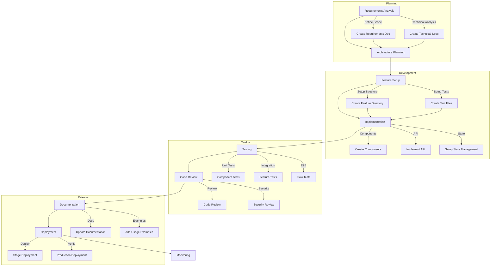
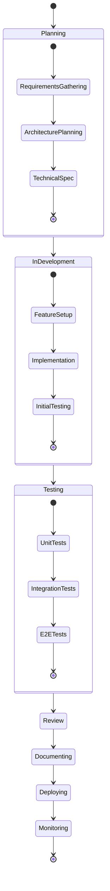
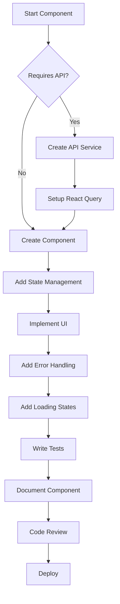
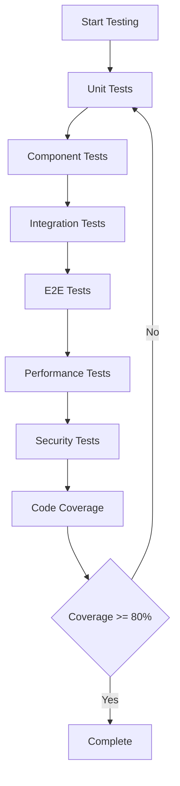

# Feature Implementation Workflow

## Feature Development Lifecycle

```mermaid
graph TD
    A[Requirements Analysis] --> B[Architecture Planning]
    B --> C[Feature Setup]
    C --> D[Implementation]
    D --> E[Testing]
    E --> F[Code Review]
    F --> G[Documentation]
    G --> H[Deployment]
    H --> I[Monitoring]
    
    subgraph Planning
    A --> |Define Scope| A1[Create Requirements Doc]
    A --> |Technical Analysis| A2[Create Technical Spec]
    A1 --> B
    A2 --> B
    end
    
    subgraph Development
    C --> |Setup Structure| C1[Create Feature Directory]
    C --> |Setup Tests| C2[Create Test Files]
    C1 --> D
    C2 --> D
    D --> |Components| D1[Create Components]
    D --> |API| D2[Implement API]
    D --> |State| D3[Setup State Management]
    end
    
    subgraph Quality
    E --> |Unit Tests| E1[Component Tests]
    E --> |Integration| E2[Feature Tests]
    E --> |E2E| E3[Flow Tests]
    F --> |Review| F1[Code Review]
    F --> |Security| F2[Security Review]
    end
    
    subgraph Release
    G --> |Docs| G1[Update Documentation]
    G --> |Examples| G2[Add Usage Examples]
    H --> |Deploy| H1[Stage Deployment]
    H --> |Verify| H2[Production Deployment]
    end
```

## Feature Implementation States

```mermaid
stateDiagram-v2
    [*] --> Planning
    Planning --> InDevelopment
    InDevelopment --> Testing
    Testing --> Review
    Review --> Documenting
    Documenting --> Deploying
    Deploying --> Monitoring
    Monitoring --> [*]
    
    state Planning {
        [*] --> RequirementsGathering
        RequirementsGathering --> ArchitecturePlanning
        ArchitecturePlanning --> TechnicalSpec
        TechnicalSpec --> [*]
    }
    
    state InDevelopment {
        [*] --> FeatureSetup
        FeatureSetup --> Implementation
        Implementation --> InitialTesting
        InitialTesting --> [*]
    }
    
    state Testing {
        [*] --> UnitTests
        UnitTests --> IntegrationTests
        IntegrationTests --> E2ETests
        E2ETests --> [*]
    }
```

## Component Development Flow

```mermaid
graph TD
    A[Start Component] --> B{Requires API?}
    B -- Yes --> C[Create API Service]
    B -- No --> D[Create Component]
    C --> E[Setup React Query]
    E --> D
    D --> F[Add State Management]
    F --> G[Implement UI]
    G --> H[Add Error Handling]
    H --> I[Add Loading States]
    I --> J[Write Tests]
    J --> K[Document Component]
    K --> L[Code Review]
    L --> M[Deploy]
```

## Testing Flow

```mermaid
graph TD
    A[Start Testing] --> B[Unit Tests]
    B --> C[Component Tests]
    C --> D[Integration Tests]
    D --> E[E2E Tests]
    E --> F[Performance Tests]
    F --> G[Security Tests]
    G --> H[Code Coverage]
    H --> I{Coverage >= 80%}
    I -- Yes --> J[Complete]
    I -- No --> B
```